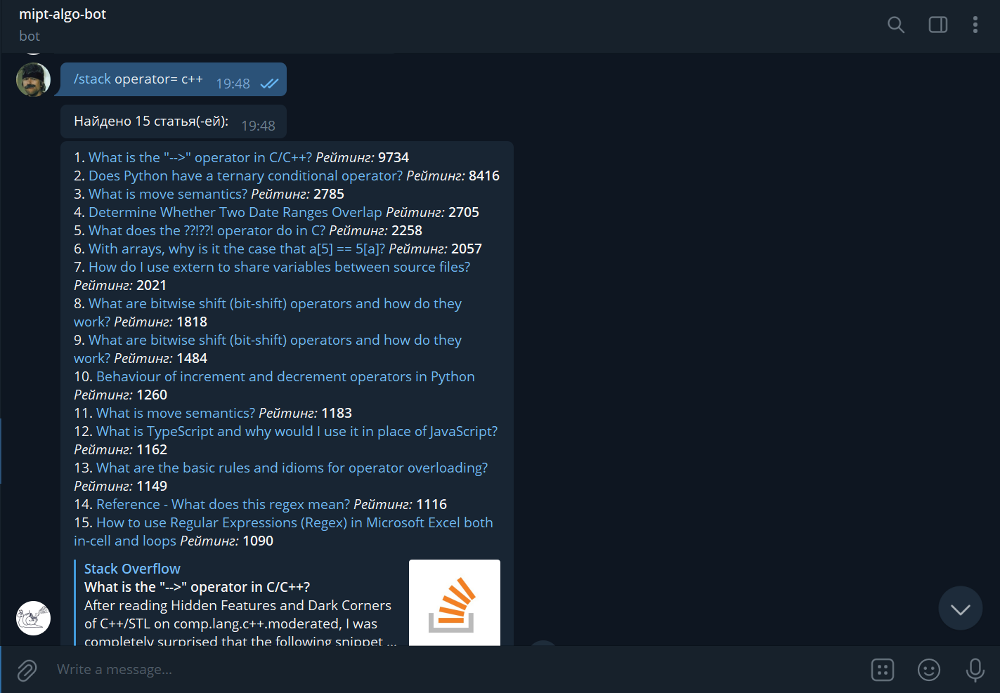
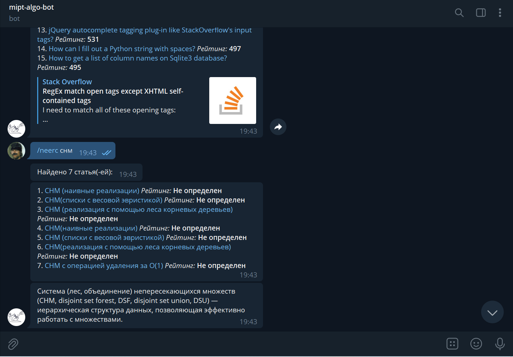

# mipt-flowchart-bot

https://t.me/MIPTAlgoBot

## Обзор

С помощью этого бота вы cможете найти алгоритм или страницу stackoverflow по ошибке.
Бот собирается в контейнер и имеет [репозиторий](https://hub.docker.com/repository/docker/zykovta/algobot) на docker hub.
При парсинге со stackoverflow бот может упираться в капчу. Тогда нужно зайти на сайт и просто пройти капчу за него.
## Build

Инструкции ниже собирают и запускают бота локально на `virtual environment`
* Через скрипт `setup.sh`
    ``` 
    ./setup.sh 
    ```

* Полностью через терминал. Установка виртуалки и зависимостей.
  ```sh
  sudo apt install python3-venv
  python3 -m venv venv
  source venv/bin/activate
  python -m pip install -r requirements.txt
  deactivate
  ```

## Запуск

Через терминал. 
  ```sh
  source venv/bin/activate
  python3 main.py
  ```

Чтобы выйти прервите процесс и закройте виртуалку.
  ```
  deactivate
  ```

### Скриншоты


